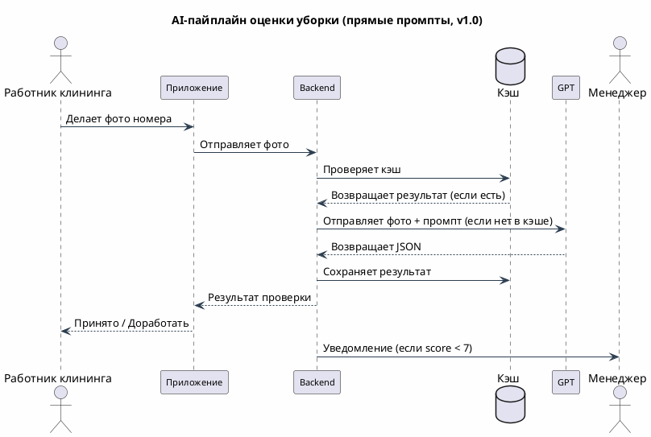

# Дизайн AI-пайплайна

---

## 1. Схема пайплайна (прямые промпты)

Выбран подход прямых промптов  —  (обоснование в research.md, раздел 1.4.) RAG и агентные схемы отклонены как overengineering для MVP (lab1.md подтвердил, что структурированный промпт с чек-листом даёт нужное качество).

### 1.1. Визуальная схема (PlantUML)

---

## 2. Точки контроля качества и логирования

Пайплайн без точек контроля — чёрный ящик. Ниже зафиксированы все контрольные точки с метриками и действиями при провале.

### 2.1. Таблица точек контроля
| # | Точка | Что проверяем                                      | Метрика | Что делаем при провале                                                              |
|---|-------|----------------------------------------------------|---------|-------------------------------------------------------------------------------------|
| 1 | Валидация входа | Размер, формат, разрешение, размытие фото          | Процент отклонённых фото: меньше 10% | Подсказка работнику "Сделайте фото чётче", обучение правильному фотографированию    |
| 2 | Попадание в кэш | Совпадение хэша изображения в кэше                 | Попаданий в кэш: больше 15% | Если попаданий мало - чаще обращаемся к AI, пересматриваем бюджет                   |
| 3 | Валидация ответа | Структура ответа от AI                             | Ошибок чтения ответа: меньше 1% | 1 повторная попытка - ручная проверка                                               |
| 4 | Проверка на адекватность | Оценка от 0 до 10, нарушения согласованы с оценкой | Странных ответов: меньше 0.5% | Запись в журнал, ручной разбор                             |
| 5 | Мониторинг бюджета | Расход токенов или план                            | Остаток бюджета: уведомления при 70/80/90% | Автоматическое переключение на экономный промпт при 80%, на запасную модель при 90% |
| 6 | Ограничение частоты запросов | Ошибки "слишком много запросов" от сервиса         | Таких ошибок: меньше 2% | Очередь задач + повторные попытки с задержкой                                       |
| 7 | Скорость ответа | Время ответа                                       | 95% запросов быстрее 5 секунд | Переключение на GigaChat или ручную проверку                                        |
| 8 | Качество ответа | Ложные срабатывания и пропуски грязи               | Ложных срабатываний <10%, пропусков грязи <15% | Сравнительные тесты промптов, сбор датасета для дообучения                          |
| 9 | Уверенность модели | Поле "уверенность = низкая"                        | Неуверенных ответов: меньше 20% | Автоматическая отправка менеджеру на ручную проверку                                |
| 10 | Доступность | Время работы системы                               | Система работает больше 99% времени | Переключение на ручную проверку, уведомление инженерам                              |
### 2.2. Логирование

### Что записывается в журнал на каждую проверку:

| Что записываем | Зачем нужно |
|----------------|-------------|
| Номер проверки | Чтобы найти конкретную проверку, если что-то пошло не так |
| ID номера и горничной | Чтобы понять, кто и где убирал |
| Тип комнаты | Спальня, ванная или общая (влияет на проверку) |
| Какая модель проверяла | GPT-4o-mini или GigaChat или запасная |
| Версия промпта | Чтобы сравнивать, какой промпт работает лучше |
| Сколько токенов потратили (вход/выход) | Чтобы считать стоимость |
| Стоимость в рублях | Чтобы контролировать бюджет |
| Сколько времени думала модель | Чтобы следить за скоростью |
| Оценка (0-10) | Результат проверки |
| Уверенность модели | Высокая/средняя/низкая (если низкая — отправляем менеджеру) |
| Был ли ответ из кэша | Чтобы понять, сэкономили ли мы токены |
| Сколько раз повторяли запрос | Если были ошибки |
| Код ошибки | Если что-то сломалось |
| Использовалась ли запасная модель | Чтобы отслеживать fallback |

---

## 3. Границы контекста: что модель видит и чего не видит

### 3.1. Что модель видит 

| Источник | Данные                                              | Стоимость | Зачем нужно |
|----------|-----------------------------------------------------|-----------|-------------|
| Фото | Изображение номера (high detail, ~1100 токенов)     | ~1100 input токенов | Основной источник информации |
| Тип комнаты | room_type из метаданных (спальня / санузел / общая) | ~5 токенов | Контекст интерпретации (кровать vs сантехника) |
| Системный промпт | Роль "строгий инспектор" + чек-лист + инструкции    | ~300 токенов | Формат вывода, борьба с галлюцинациями |
| Инструкции по игнорированию | "Игнорируй тени, блики, влажные поверхности"        | ~50 токенов | Снижение false positives |

**Итого входной контекст:** ~1450–1500 токенов (без фото), ~1700 токенов (с фото high detail).

### 3.2. Что модель не видит 
| Данные | Почему не видим | Риск |
|--------|-----------------|------|
| История номера (предыдущие проверки, жалобы гостей) | Увеличивает контекст на 500+ токенов, дорого | Модель не знает, что номер "проблемный" |
| Стандарты отеля (чек-лист на 50 пунктов) | Слишком большой контекст, модель запутается | Несоответствие стандартам конкретного отеля |
| Предыдущие фото этого номера  | Требует RAG, отклонён в research.md | Нет сравнения с "эталонным" состоянием |
| Время суток и расписание уборки | Не передаётся в промпте | Модель не понимает, "до" или "после" уборки |
| Личные данные гостей | 152-ФЗ, данные не должны уходить в AI | Юридический риск |
| Планировка номера | Нет в промпте | Модель может не понять, где должна быть кровать |

### 3.3. Что модель "додумывает" (галлюцинации)

Даже в рамках заданного контекста модель может выходить за границы:

| Тип ошибки модели | Пример из экспериментов | Как мы это решаем в промпте                                                                            |
|-------------------|-------------------------|--------------------------------------------------------------------------------------------------------|
| Видит несуществующее | Принимает тени от мебели за "следы пыли" | Прямо пишем в инструкции: "Игнорируй тени и блики"                                                     |
| Не понимает контекст | Считает капли воды в раковине грязью | Прямо пишем: "Влажные поверхности после уборки - это норма"                                            |
| Путает узоры с грязью | Называет мозаичный узор на плитке "разводом" | Используем GPT (он лучше различает текстуры) + просим модель писать "не уверен", если освещение плохое |
| Завышает оценку | Ставит 8/10, даже если не уверена в чистоте | Задаем роль "строгого инспектора" и требуем обязательно указывать уровень уверенности                  |

